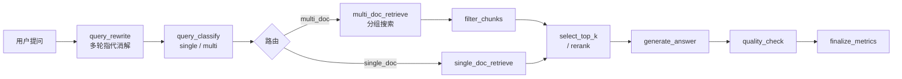

💎 定制版本 & 技术服务
本开源版本满足基础部署与使用需求，如需专属定制开发、功能迭代、私有化部署调试、界面优化、功能新增、问题运维排错等个性化服务，可联系作者获取定制版源码与一对一技术支持。
- 亲民定价：仅一顿饭钱，低成本获取专属定制服务与完整优化版项目
- 定制内容：功能定制、bug修复、界面改版、部署适配、参数优化、新增特色功能、版本升级迁移等
- 配套服务：提供部署教程、使用指导、后期答疑、小幅功能免费微调

源码获取方式 （QQ）：504781353


# AI 智能知识库问答系统

**基于大模型 \+ RAG \+ 多模态能力的企业级智能知识库问答系统**

✨ 轻量化部署｜前后端分离｜多模态图文问答｜精细化检索重排｜动态知识库配置｜持久化对话记忆

---

## 📖 项目简介

本项目是一套**开箱即用、可快速私有化部署**的AI智能知识库问答系统。依托阿里百炼大模型能力，结合LangChain、LangGraph智能工作流与向量检索技术，实现个性化知识库搭建、智能文档处理、多模态图文解析、高精度智能问答全流程能力。

系统架构轻量化、配置极简、扩展性强，无需复杂接口对接，仅需配置大模型密钥即可启用全部功能，可广泛应用于企业知识沉淀、内部文档问答、行业知识库咨询、多模态图文智能答疑等业务场景。

## 🎯 核心亮点

- **极简配置**：仅需百炼SK密钥，一键启用全量大模型能力，无需多接口对接

- **全场景覆盖**：支持文本、图文多模态问答，适配各类文档咨询场景

- **精细化检索**：融合关键词\+向量检索、重排序优化，问答准确率更高

- **动态配置**：知识库参数可实时修改，无需重建知识库，迭代成本极低

- **智能记忆**：会话隔离式对话记忆，可自定义上下文轮次，兼顾流畅度与性能

- **双存储适配**：OSS云端/本地存储自动降级，适配私有化、云端各类部署环境

---

## 🧠 大模型依赖

系统统一适配**阿里百炼模型体系**，单一密钥统一调度全场景模型，适配性强、维护简单。

|业务场景|所用模型|能力说明|
|---|---|---|
|文本对话、基础推理|qwen\-turbo、qwen\-plus|支撑多轮对话、上下文理解、常规问题推理|
|文本向量化检索|text\-embedding\-v3|通用文本嵌入，生成高精度向量用于相似度检索|
|多模态图文嵌入|qwen3\-vl\-embedding|图文内容向量化，适配图片\+文本混合文档检索|
|多模态内容生成|qwen3\.5\-plus|解析图文文档，输出图文匹配的规范问答结果|
|检索结果重排序|qwen3\-rerank|对召回内容精细化排序，提升问答精准度|

---

## 🏗️ 技术架构

项目采用**前后端分离架构**，结构清晰、高可用、易拓展、支持二次开发。

### 后端技术栈

- **AI 框架**：LangChain、LangGraph（构建RAG流水线、对话记忆、智能工作流）

- **服务框架**：FastAPI（高性能异步接口，响应速度快、稳定性高）

- **向量数据库**：Milvus（存储文档向量，实现高效相似度检索）

- **关系数据库**：PostgreSQL（持久化会话、文件、知识库、问答业务数据）

### 前端技术栈

- **核心框架**：Vue

- **交互特点**：界面简洁直观、操作轻量化，适配普通用户与运维管理员

### 数据库分层设计

1. **Checkpoint 会话数据表**
用于存储对话记忆快照、会话状态、记忆缓存、会话关联数据，实现**多会话记忆隔离、对话状态永久留存**，不同对话上下文互不干扰。

2. **核心业务数据表**
涵盖文件类目、知识库配置、文档切片、向量关联关系、问答记录等全量业务数据，完整留存系统运行全生命周期数据，保障业务可追溯、可迭代。

---

## ⚙️ 核心功能模块

### 1\. 对话记忆管理

- 基于LangChain Checkpoint实现精细化会话隔离，不同对话记忆独立存储、互不干扰

- 支持自定义最大记忆轮次，灵活控制上下文长度

- 平衡对话连贯性与模型推理性能，避免上下文过长导致的卡顿、资源占用过高问题

### 2\. 智能文件管理

- 支持自定义多级类目文件夹，实现文档分类规范化管理

- 双存储自适应策略：优先OSS云端对象存储，未配置OSS自动降级为本地存储

- 无需人工切换，完美适配内网私有化、云端部署等各类场景

### 3\. 多类型知识库创建

系统支持三种差异化知识库类型，全覆盖业务需求：

- 纯文本知识库：适配纯文字文档问答场景

- 图文并茂输出知识库：支持文本为主、辅助图文展示问答结果

- 多模态知识库：支持图文输入、图文联动输出全流程能力

创建支持全参数自定义：标题增强、Embedding模型选择、向量化维度、相似度算法、检索策略、单/多文档召回数量、Rerank重排开关等，精细化定制问答效果。

### 4\. 知识库动态配置修改

- 已创建知识库支持**无感知动态改参**，无需重建知识库、无需重新上传文档

- 支持修改所有创建阶段自定义参数，可单独调整重排序结果展示数量

- 灵活适配不同场景的检索精度需求，大幅降低知识库迭代成本

### 5\. 文档上传与智能切片

- 多样化导入：单文件类目上传、Excel批量导入，高效批量建库

- 自定义切片规则：可配置切片大小、重叠区域，适配不同文本分割精度

- 全维度手动编辑：支持修改切片文本、替换切片图片、批量清洗无效数据

- 双库同步落库：切片向量化数据存入Milvus向量库，原始业务数据持久化至PostgreSQL

**多模态专属优化**：

- 向量化采用纯净文本切片（去除图片占位符），保障检索精准度

- 大模型推理采用完整带占位符切片，精准识别图片位置

- 彻底解决多模态问答图片错位、缺失、排版混乱问题

### 6\. 高精度智能问答

- 智能自适应检索：自动提取关键词，切换**纯关键词检索 / 向量\+关键词融合检索**模式

- 场景智能路由：自动判断单文档精准检索 / 多文档分组检索

- 支持手动强制关键词检索，适配长字符串精准匹配、专业术语检索场景

- 多层筛选\+重排序优化，全方位提升问答准确率与匹配质量

---

## 🔁 核心问答工作流

系统基于LangGraph搭建标准化RAG问答流水线，流程闭环、逻辑严谨、可定制拓展。



---

## 📁 项目目录结构

```Plain Text
├── docker-compose.yml       # Docker容器一键部署配置
├── backend/                 # 后端核心服务
│   ├── app/
│   │   ├── api/v1/          # RESTful API 路由接口
│   │   ├── core/            # 全局配置、日志、异常处理、Prompt管理
│   │   ├── services/        # 核心业务服务（切片、重排、问答、文件服务）
│   │   └── db/              # 数据库仓储层、数据持久化逻辑
│   └── agents/
│       └── knowledge/       # RAG智能体、问答流水线、Graph节点定义
├── frontend/                # 前端Vue项目
│   └── src/
│       ├── components/      # 通用业务组件（含Excel批量上传组件）
│       └── services/        # 前端API请求封装
```

---

## 🚀 快速部署

### 环境依赖

- Docker \&amp; Docker Compose

- PostgreSQL 14\+

- Milvus 向量数据库

- 阿里百炼 SK 密钥

### 部署步骤

1. **克隆项目**

2. **配置环境变量**
填写百炼SK密钥、数据库连接信息、OSS存储配置（可选）

3. **一键启动服务**

```Plain Text
docker-compose up -d
```

1. **初始化数据库**：自动创建业务数据表与Checkpoint数据表

2. **访问系统**：打开前端页面，即可创建知识库、上传文档、智能问答

---


